---
## Front matter
lang: ru-RU
title: Лабораторная работа №1
subtitle: Установка и конфигурация операционной системы на виртуальную машину
author:
  - Афтаева К.В.
institute:
  - Российский университет дружбы народов им. Патриса Лумумбы, Москва, Россия
date: 9 сентября 2023

## i18n babel
babel-lang: russian
babel-otherlangs: english

## Formatting pdf
toc: false
toc-title: Содержание
slide_level: 2
aspectratio: 169
section-titles: true
theme: metropolis
header-includes:
 - \metroset{progressbar=frametitle,sectionpage=progressbar,numbering=fraction}
 - '\makeatletter'
 - '\beamer@ignorenonframefalse'
 - '\makeatother'
---

# Информация

## Докладчик

:::::::::::::: {.columns align=center}
::: {.column width="70%"}

  * Афтаева Ксения Васильевна
  * студент группы НПИбд-01-20
  * Российский университет дружбы народов им. Патриса Лумумбы 
  * [1032201739@pfur.ru](mailto:1032201739@pfur.ru)
  * <https://github.com/KVAftaeva/study_2023-2024_infosec>

:::
::: {.column width="30%"}

:::
::::::::::::::

# Вводная часть

## Актуальность

- Необходим навык работы с репозиториями
- Для обозначения форматирования в простом тексте, с максимальным сохранением его читаемости человеком, для создания продвинутых публикаций необходим навык работы на Markdown
- Для дальнейшей работы в рамках курса нужна виртуальная машина ОС Linux

## Объект и предмет исследования

- GitHub как служба размещения в Интернете репозиториев Git
- Язык разметки Markdown
- Виртуальная машина ОС Linux (дистрибутив Rocky)

## Цели и задачи

- Создать репозиторий курса на github.com на основе шаблона и соглашений о наименовании, описанных на странице курса
- Подготовить рабочее пространство для лабораторных работ
- Установить необходимые для дальнейшей работы программы (pandoc, texlive и т.д.)
- Установить и конфигурировать операционную систему на виртуальную машину 

## Материалы и методы

- Служба размещения в Интернете репозиториев GitHub
- Процессор `pandoc` для входного формата Markdown
- Результирующие форматы
	- `pdf`
	- `docs`
- Дистрибутив Rocky

# Выполнение работы

## Создание репозитория

Создан с помощью шаблона

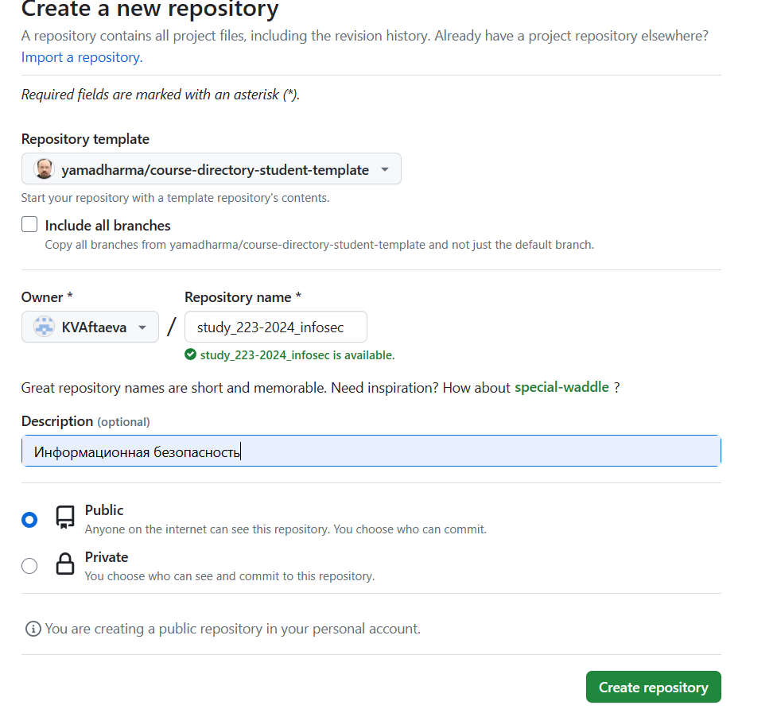{width=70%}

## Клонирование репозитория

Для клонирования используем скопированный ssh из репозитория

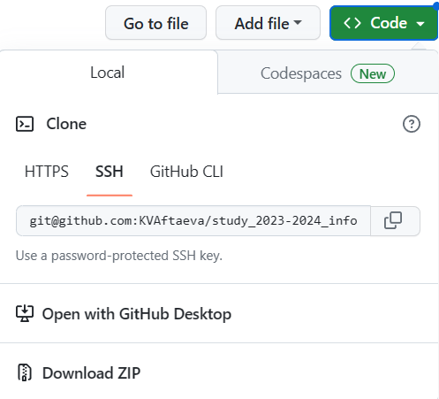{width=70%}

## Рабочее пространство для лабораторных работ

В каталоге "labs" папки для каждой из лабораторных работ

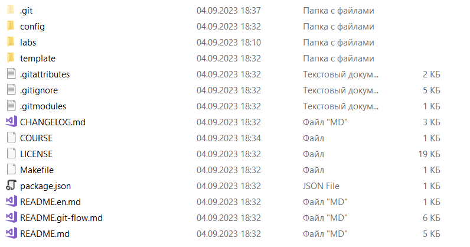{width=70%}

## Отправка файлов на сервер

Команды: 

`git add .` 

`git commit -am 'feat(main): make course structure'` 

`git push`

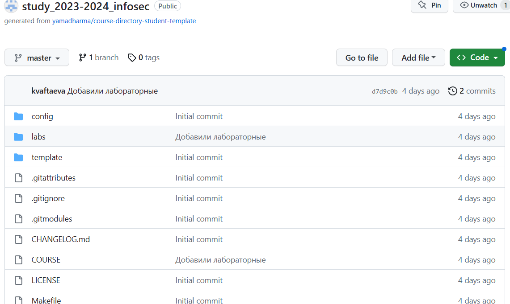{width=70%}

## Генерирование нужных форматов

Все нужные приложения и настройки остались с прошлого курса

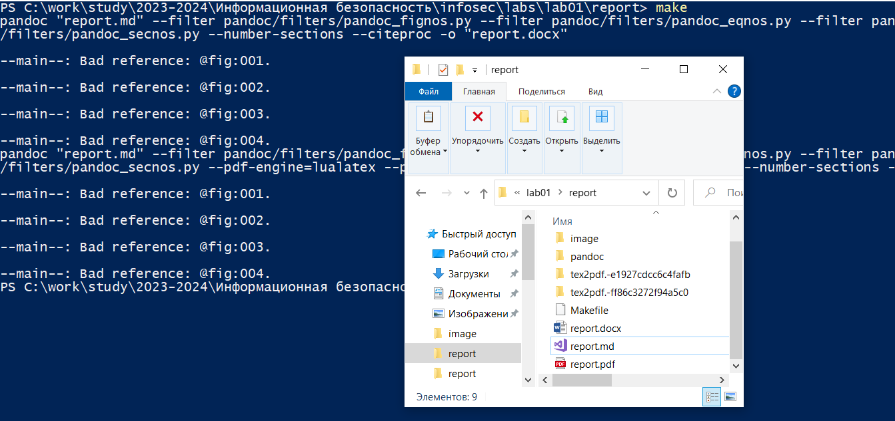{width=70%}

## Создание виртуальной машины

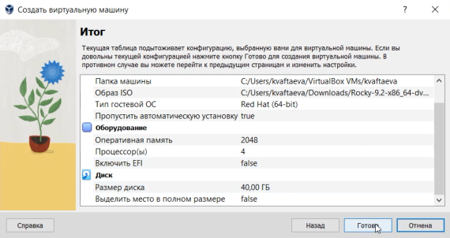{width=70%}

## Настройка виртуальной машины

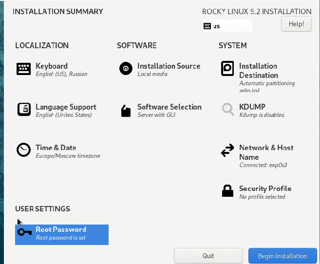{width=70%}

## Запуск образа диска дополнений гостевой ОС

{width=70%}

## Выполнение домашнего задания

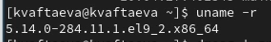{width=70%}

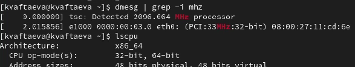{width=70%}

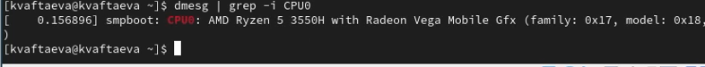{width=70%}

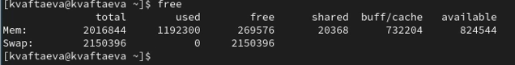{width=70%}

# Результаты

## Результат

- Создан репозиторий курса на github.com на основе шаблона и соглашений о наименовании, описанных на странице курса
- Установлены необходимые для дальнейшей работы программы (pandoc, texlive и т.д.)
- Подготовлено рабочее пространство для лабораторных работ
- Создана и настроена виртуальная машина для дальнейших лабораторных работ

# Вывод

## Вывод

Я создала репозиторий курса на github.com на основе шаблона. Подготовила рабочее пространство для лабораторных работ. Установила
операционную систему на виртуальную машину. 
