---
## Front matter
title: "Отчет по лабораторной работе №1"
subtitle: "Дисциплина: Информационная безопасность"
author: "Выполнила: Афтаева Ксения Васильевна"

## Generic otions
lang: ru-RU
toc-title: "Содержание"

## Bibliography
bibliography: bib/cite.bib
csl: pandoc/csl/gost-r-7-0-5-2008-numeric.csl

## Pdf output format
toc: true # Table of contents
toc-depth: 2
lof: true # List of figures
lot: true # List of tables
fontsize: 12pt
linestretch: 1.5
papersize: a4
documentclass: scrreprt
## I18n polyglossia
polyglossia-lang:
  name: russian
  options:
	- spelling=modern
	- babelshorthands=true
polyglossia-otherlangs:
  name: english
## I18n babel
babel-lang: russian
babel-otherlangs: english
## Fonts
mainfont: PT Serif
romanfont: PT Serif
sansfont: PT Sans
monofont: PT Mono
mainfontoptions: Ligatures=TeX
romanfontoptions: Ligatures=TeX
sansfontoptions: Ligatures=TeX,Scale=MatchLowercase
monofontoptions: Scale=MatchLowercase,Scale=0.9
## Biblatex
biblatex: true
biblio-style: "gost-numeric"
biblatexoptions:
  - parentracker=true
  - backend=biber
  - hyperref=auto
  - language=auto
  - autolang=other*
  - citestyle=gost-numeric
## Pandoc-crossref LaTeX customization
figureTitle: "Рис."
tableTitle: "Таблица"
listingTitle: "Листинг"
lofTitle: "Список иллюстраций"
lotTitle: "Список таблиц"
lolTitle: "Листинги"
## Misc options
indent: true
header-includes:
  - \usepackage{indentfirst}
  - \usepackage{float} # keep figures where there are in the text
  - \floatplacement{figure}{H} # keep figures where there are in the text
---

# Цель работы

Создание репозитория курса на github.com на основе шаблона.  Подготовка рабочего пространства для лабораторных работ. Установка и конфигурация
операционной системы на виртуальную машину.

# Задание

1. Создать репозиторий курса на github.com на основе шаблона и соглашений о наименовании, описанных на странице курса.
2. Подготовить рабочее пространство для лабораторных работ.
3. Установить необходимые для дальнейшей работы программы (pandoc, texlive и т.д.).
4. Установить и конфигурировать операционную систему на виртуальную машину. 

# Теоретическое введение
В ходе данного курса мы будем работать с **репозиторием** и выгружать результаты своей работы на github. **Репозиторий или проект GIT** включает в себя полный набор файлов и папок, связанных с проектом, а также журнал изменений каждого файла. Журнал файла представлен в виде моментальных снимков на определенные моменты времени. Эти снимки называются фиксациями. Фиксации можно упорядочивать по нескольким линиям разработки, называемым ветвями. Так как GIT — распределенная система управления версиями, репозитории являются автономными единицами и любой пользователь, имеющий копию репозитория, может получать доступ ко всей базе кода и ее истории. С помощью командной строки или других удобных интерфейсов возможны также следующие действия с репозиторием GIT: взаимодействие с журналом, клонирование репозитория, создание ветвей, фиксация, слияние, сравнение изменений в разных версиях кода и многое другое [@key-1].

Для выполнения отчетов в данном курсе мы будем использовать **Markdown** — это облегченный язык разметки с синтаксисом форматирования обычного текста. Несмотря на то, что файлы с разметкой Markdown имеют собственный формат .md или .markdown, они содержат только текст и могут создаваться в любых программах типа Блокнот.  Однако, его можно без проблем конвертировать и в гипертекст, и даже в документ с визуальным оформлением (RTF или DOC) без потери форматирования [@key-2].

В данном курсе подразумевается работа на виртуальной машине операционной системы Linux (дистрибутив Rocky). **Rocky Linux** — дистрибутив на базе RedHat Enterprise Linux. Является альтернативой CentOS. Распространяется свободно. Поддерживается сообществом. Релизы Rocky Linux выходят аналогично тому, как ранее выходили релизы CentOS. Выпуск очередного релиза Rocky Linux выполняется после выхода новой версии RedHat Enterprise Linux [@key-3].

Доступны следующие образы системы:

  - Minimal

  - DVD

  - Boot

Формат образа: ISO

# Выполнение лабораторной работы

1. Так как у меня уже был аккаунт на **github.com**, я авторизировалась в уже имеющейся учетной записи (рис. @fig:001).

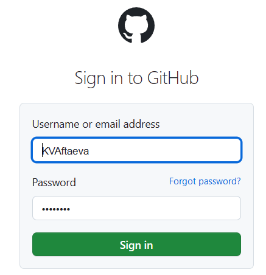{#fig:001 width=70%}

2. Создала рабочее пространство предмета в соответствии с требуемой [@key-5] иерархией (рис. @fig:002).

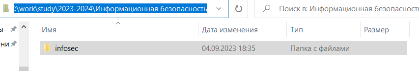{#fig:002 width=70%}

3. Создала репозиторий по шаблону, предложенному на странице курса (рис. @fig:003).

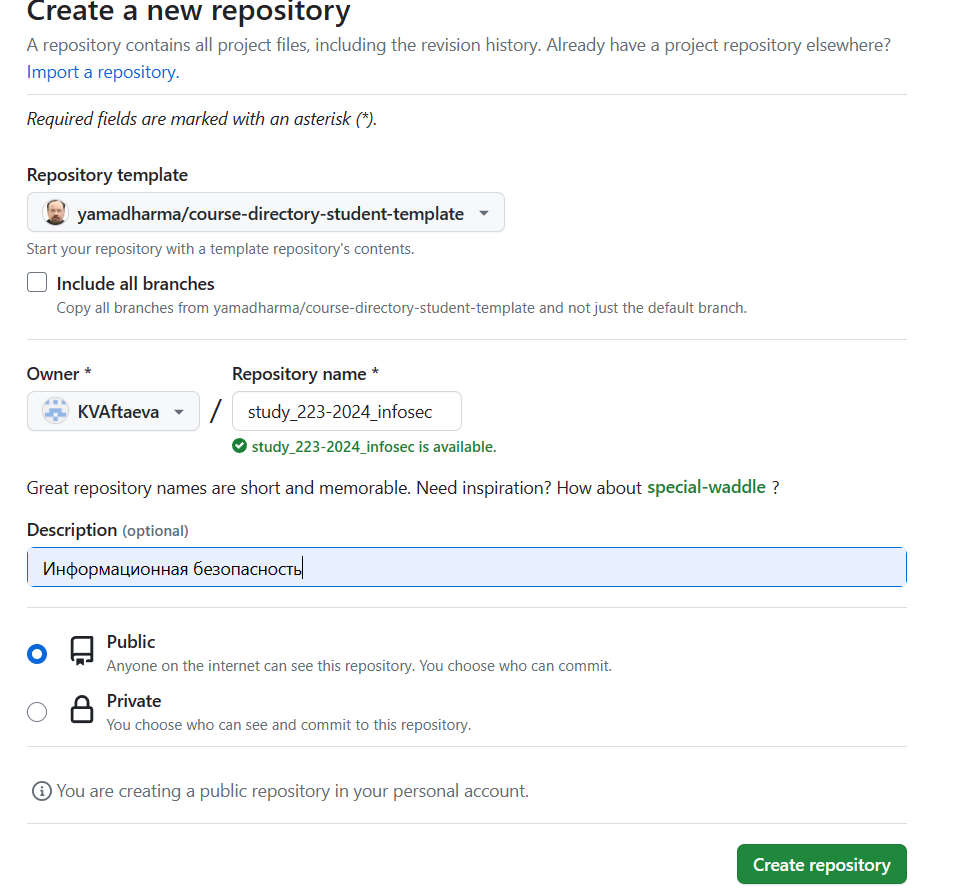{#fig:003 width=70%}

Видим, что репозиторий успешно создан (рис. @fig:004).

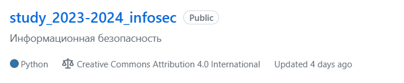{#fig:004 width=70%}

4. После одного из предыдущих курсов у меня был установлен **git**, а также сохранен ключ. Проверила, что все установлено, введя команду ```git -v``` (рис. @fig:005).

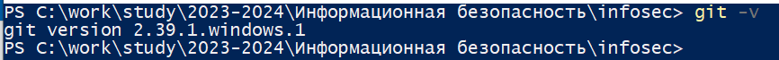{#fig:005 width=70%}

5. Скопировала ssh из репозитория (рис. @fig:006) и использовала его для рекурсивного копирования этого репозитория с помощью команды ```git clone --recursive```. Видим, что теперь соответтвующее рабочее пространство появилось на моем рабочем устройстве (рис. @fig:007).

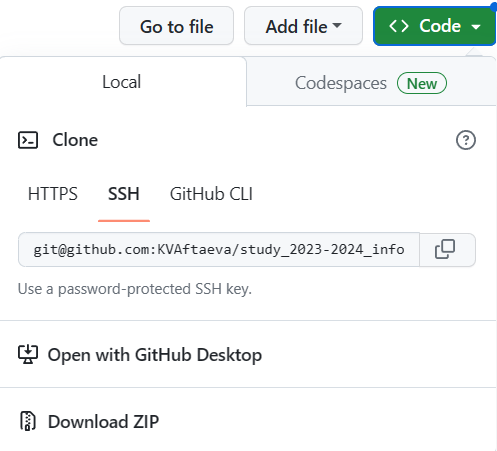{#fig:006 width=70%}

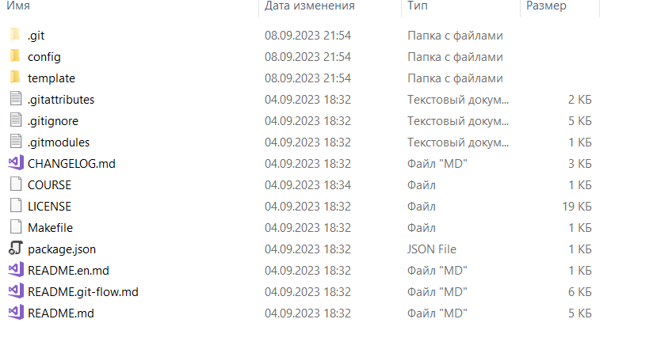{#fig:007 width=70%}

6. Создала папки для лабораторных работ (рис. @fig:008), перенеся соответствующие каталоги из каталога курса "Матемтическое моделирование" (рис. @fig:009).

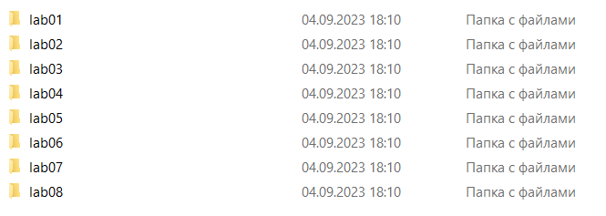{#fig:008 width=70%}

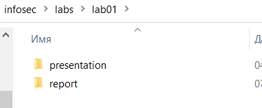{#fig:009 width=70%}

7. Отправила файлы на сервер с помощью команд ```git add .```, ```git
commit -am 'feat(main): make course structure'```, ```git push```. Перейдя в репозиторий, видим, что каталог для лабораторных был добавлен (рис. @fig:010).

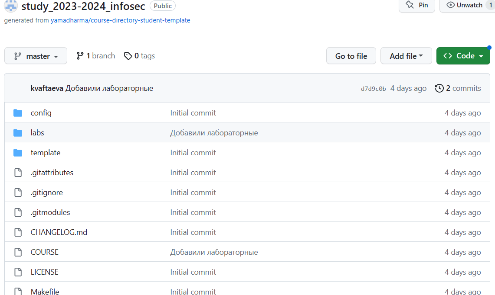{#fig:010 width=70%} 

8. После одного из предыдущих курсов у меня был установлен **pandoc** и **texlive**. Проверила, что отчеты нужных форматов генерируются, введя команду ```make``` в папке соответствующей лабораторной (рис. @fig:011). Видим, что файлы были созданы.

{#fig:011 width=70%} 

9. Скачала дистрибутив Rocky с предложенного сайта (рис. @fig:012).

{#fig:012 width=70%} 

10. Создала новую виртуальную машину (рис. @fig:013). Для этого в VirtualBox выбрала
```Машина``` - ```Создать``` .
Указала имя виртуальной машины (мой логин в дисплейном классе), подключила образ, установленный ранее. Также выбираю пропустить автоматическую установку.

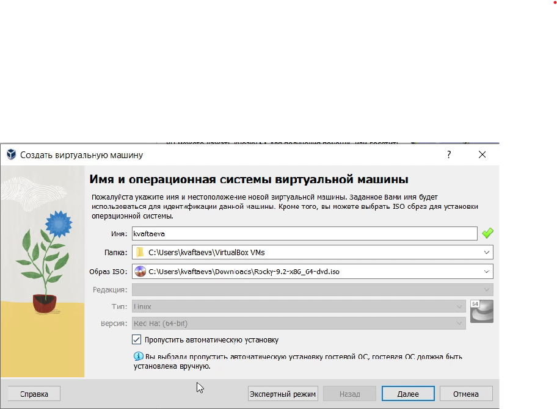{#fig:013 width=70%} 

11. Указала объем памяти (2048МБ) и количество процессоров (4) (рис. @fig:014).

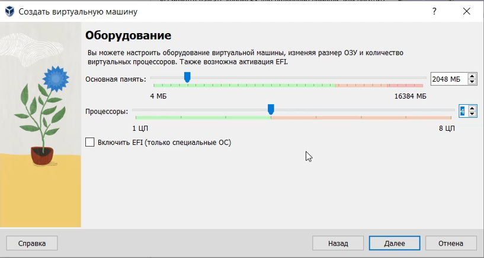{#fig:014 width=70%} 

12. Выбрала создание нового виртуального жесткого диска размером 40ГБ (рис. @fig:015).

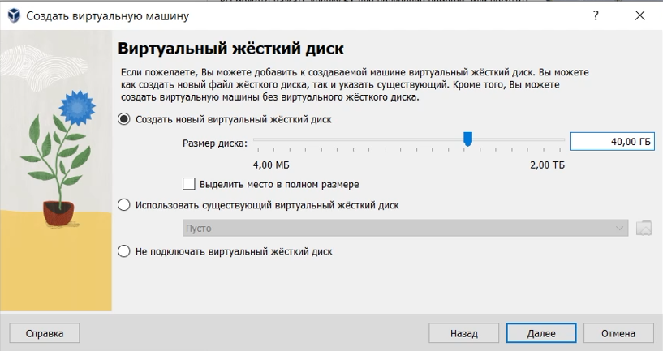{#fig:015 width=70%} 

13. Запустила виртуальную машину (рис. @fig:016).

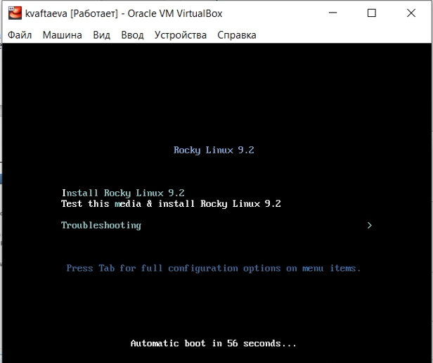{#fig:016 width=70%} 

14. Выбрала английский язык в качестве языка интерфейса (рис. @fig:017) и перешла к настройкам установки операционной системы (рис. @fig:018).

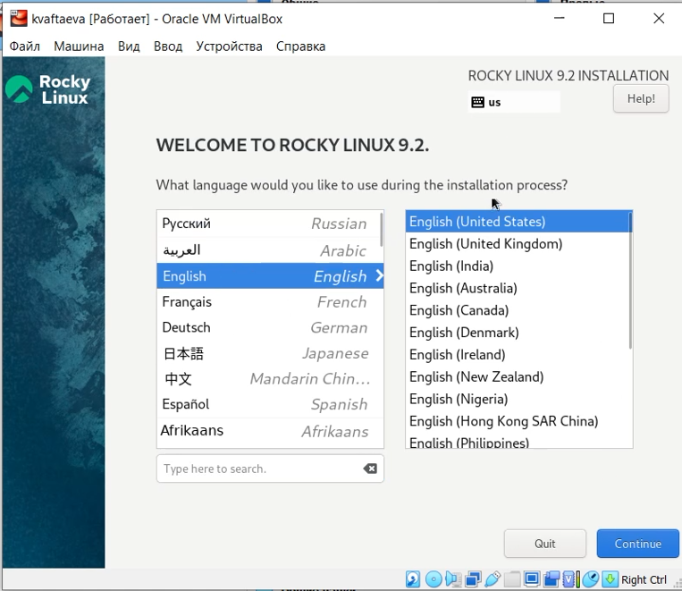{#fig:017 width=70%} 

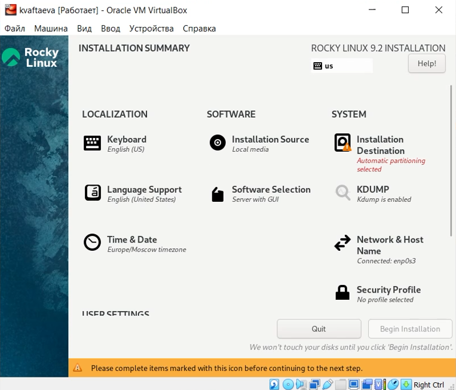{#fig:018 width=70%} 

15. Добавила в раскладку клавиатуры русский язык, оставив английский языком по умолчанию (рис. @fig:019).

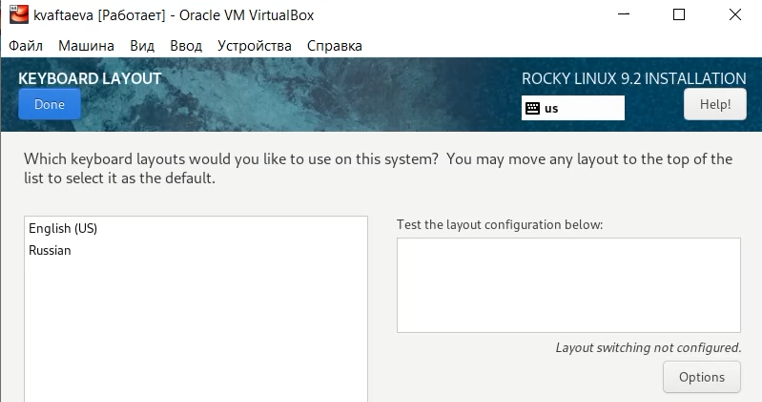{#fig:019 width=70%} 

16. В разделе выбора программ укажите в качестве базового окружения
```Server with GUI``` , а в качестве дополнения — ```Development Tools``` (рис. @fig:020).

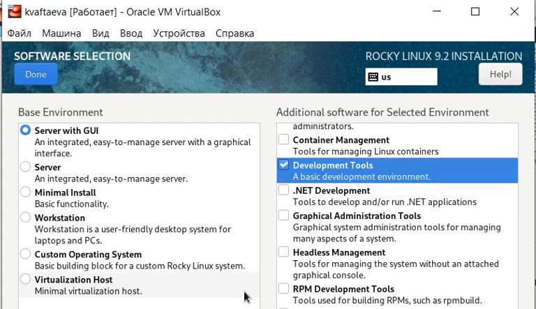{#fig:020 width=70%} 

17. Отключила KDUMP (рис. @fig:021).

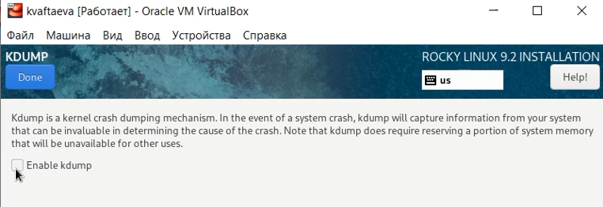{#fig:021 width=70%}

18. Включила сетевое соединение и в качестве имени узла указала kvaftaeva.localdomain (рис. @fig:022).

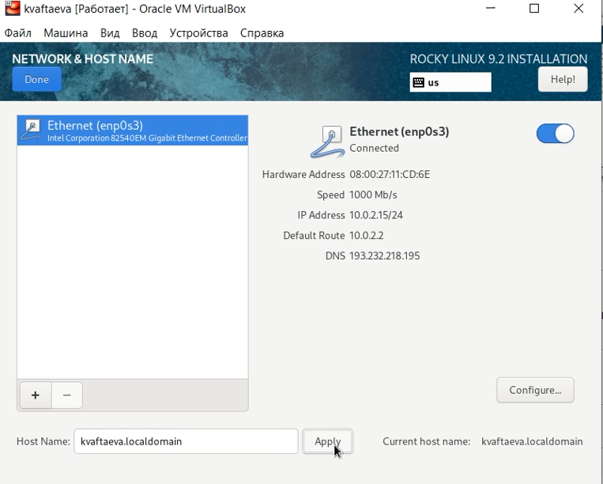{#fig:022 width=70%}

19. Установила пароль для пользователя root (рис. @fig:023).

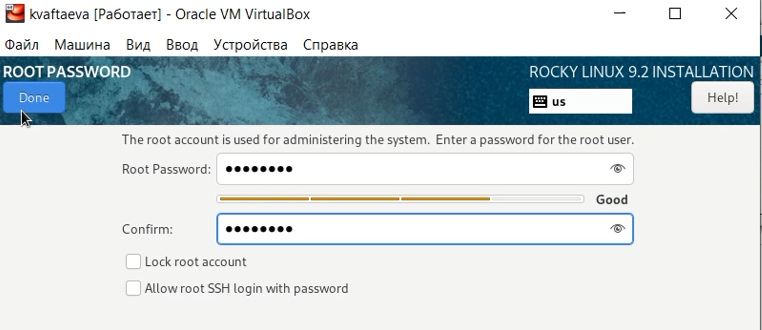{#fig:023 width=70%}

20. Дождалась завершения установки и перезапустила виртуальную машину (рис. @fig:024).

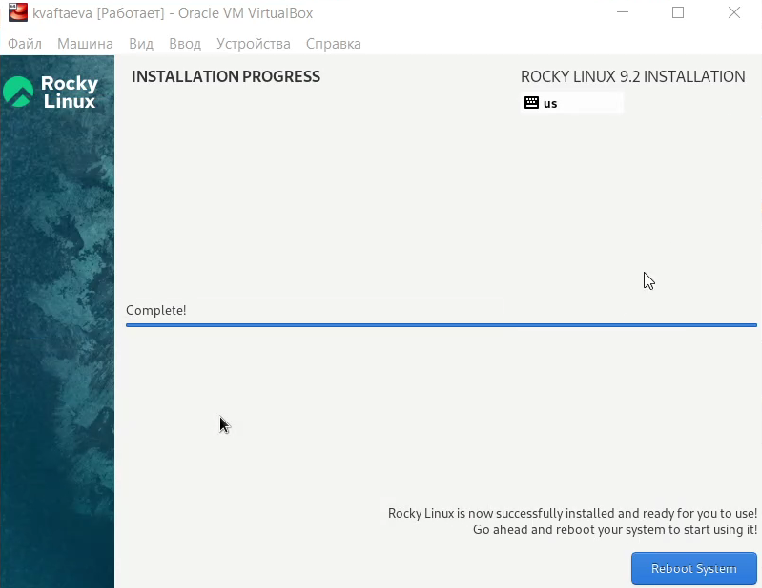{#fig:024 width=70%}

21. Задала имя пользователя (рис. @fig:025) и пароль (рис. @fig:026). Еще раз перезапустила виртуальную машину на всякий случай. Зашла под своей учетной записью после загрузки (рис. @fig:027). 

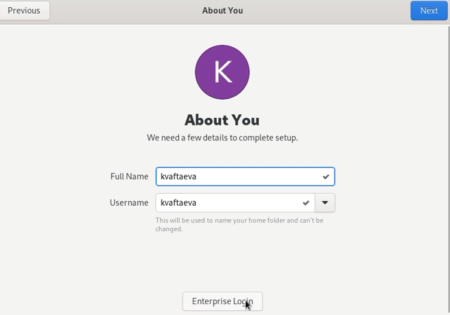{#fig:025 width=70%}

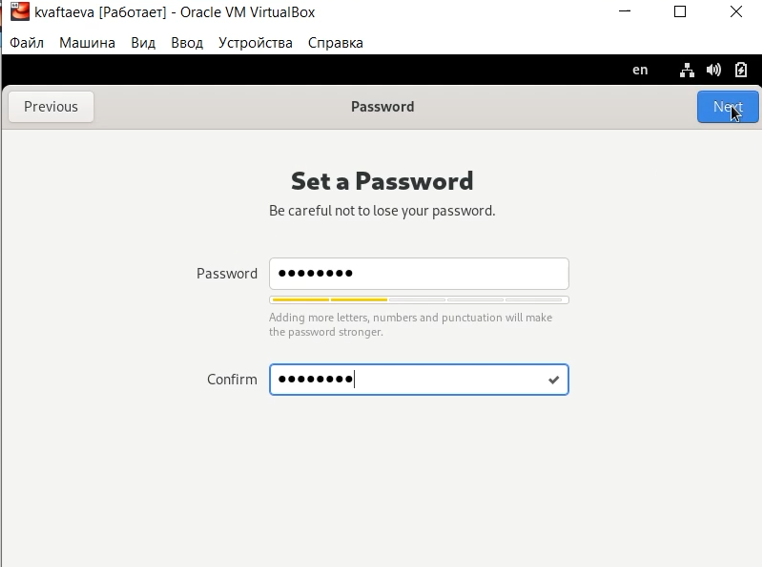{#fig:026 width=70%}

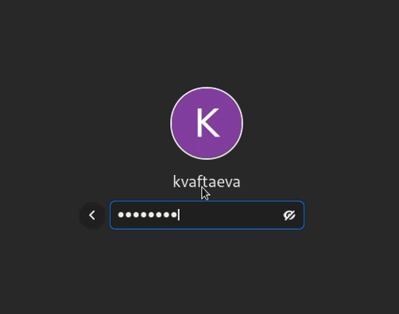{#fig:027 width=70%}

22. В меню ```Устройства``` виртуальной машины подключила образ диска дополнений гостевой ОС (рис. @fig:028-@fig:029). После загрузки перезапустила виртуальную машину.

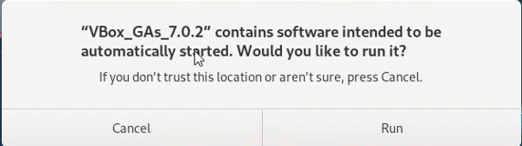{#fig:028 width=70%}

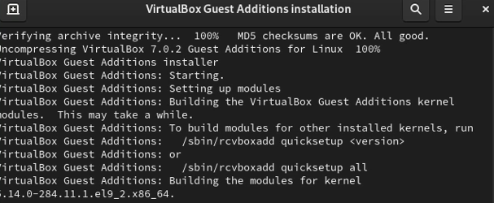{#fig:029 width=70%}

23. Проверила имя хоста, введя команду ```hostnamectl``` (рис. @fig:030). . Видим, что имя хоста задано верно. 

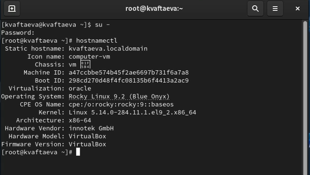{#fig:030 width=70%}

24. Выполнила команду ```dmesg``` (рис. @fig:031). Так мы видим вывод всех сообщений ядра ОС.

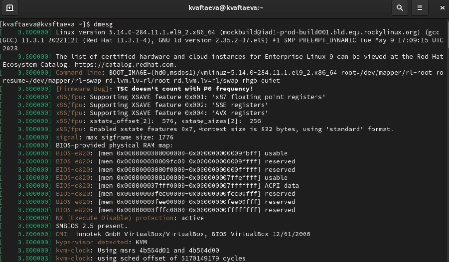{#fig:031 width=70%}

25. Получила информацию о версии ядра Linux двумя способами: с помощью команды ```dmesg | grep -i Linux``` (рис. @fig:032)и команды ```uname -r```(рис. @fig:033).

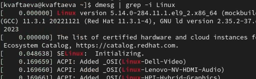{#fig:032 width=70%}

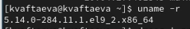{#fig:033 width=70%}

26. Получила информацию о частоте ядра с помощью команды ```dmesg | grep -i mhz``` (рис. @fig:034).

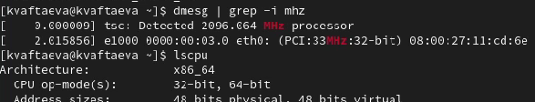{#fig:034 width=70%}

27. Получила информацию о модели процессора с помощью команды ```dmesg | grep -i CPU0``` (рис. @fig:035).

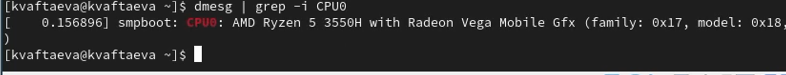{#fig:035 width=70%}

28. Получила информацию об объеме доступной памяти с помощью команды ```free``` (рис. @fig:036).

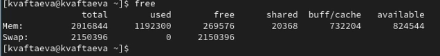{#fig:036 width=70%}

29. Получила информацию о типе обнаруженного гипервизора (KVM) с помощью команды ```lscpu``` (рис. @fig:037).

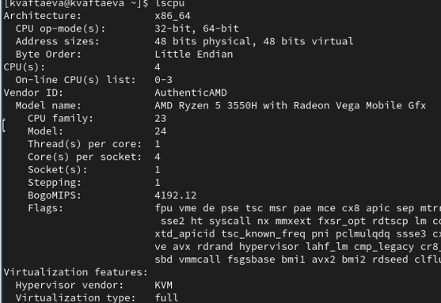{#fig:037 width=70%}

30. Получила информацию о типе файловой системы корневого раздела с помощью команды ```df -T``` (рис. @fig:038).

31. Получила информацию о последовательности монтирования файловых систем с помощью команды ```df -h``` (рис. @fig:038).

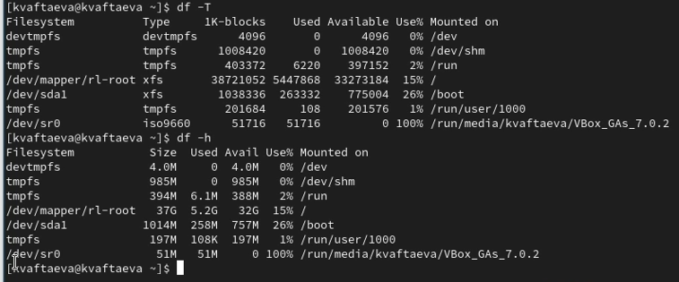{#fig:038 width=70%}

# Выводы

Я создала репозиторий курса на github.com на основе шаблона. Подготовила рабочее пространство для лабораторных работ. Установила
операционную систему на виртуальную машину. 

# Список литературы{.unnumbered}

::: {#refs}
:::
