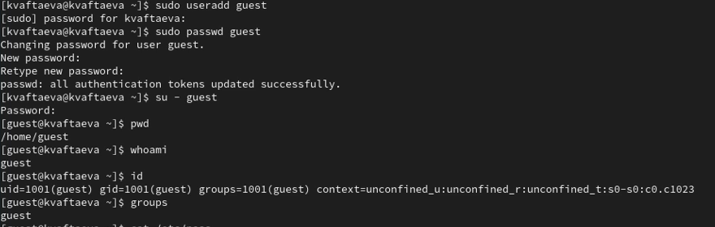
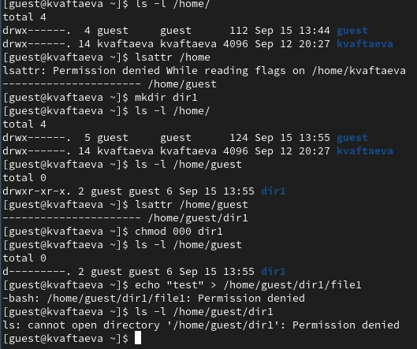
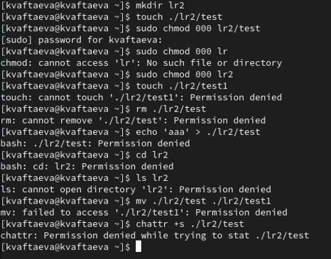

---
## Front matter
lang: ru-RU
title: Лабораторная работа №2
subtitle: Дискреционное разграничение прав в Linux. Основные атрибуты
author:
  - Афтаева К.В.
institute:
  - Российский университет дружбы народов им. Патриса Лумумбы, Москва, Россия
date: 16 сентября 2023

## i18n babel
babel-lang: russian
babel-otherlangs: english

## Formatting pdf
toc: false
toc-title: Содержание
slide_level: 2
aspectratio: 169
section-titles: true
theme: metropolis
header-includes:
 - \metroset{progressbar=frametitle,sectionpage=progressbar,numbering=fraction}
 - '\makeatletter'
 - '\beamer@ignorenonframefalse'
 - '\makeatother'
---

# Информация

## Докладчик

:::::::::::::: {.columns align=center}
::: {.column width="70%"}

  * Афтаева Ксения Васильевна
  * студент группы НПИбд-01-20
  * Российский университет дружбы народов им. Патриса Лумумбы
  * [1032201739@pfur.ru](mailto:1032201739@pfur.ru)
  * <https://github.com/KVAftaeva/study_2023-2024_infosec>

:::
::: {.column width="30%"}

:::
::::::::::::::

# Вводная часть

## Актуальность

- Система прав доступа к файлам является одной из самых важных в операционной системе Linux

## Объект и предмет исследования

- ОС Linux
- Механизм разграничения прав доступа

## Цели и задачи

1. Создать нового пользователя и получить информацию о его uid, gid и др.

2. Проверить права доступа на некоторых файлах и директориях.

3. Заполнить таблицу «Установленные права и разрешённые действия», выполняя действия от имени владельца директории.

4. На основании заполненной таблицы определите те или иные минимально необходимые права для выполнения операций внутри директории.

## Материалы и методы

- Механизм разграничения прав доступа в ОС Linux

# Выполнение работы

## Работа с новой учетной записью

{width=70%}

## Изучение прав доступа

{width=70%}

## Проверка прав доступа

{width=70%}

## Установленные права и разрешенные действия

Права директории 100

| Права файла                     | 000 | 100 | 200 | 300 | 400 | 500 | 600 | 700 |   
|---------------------------------|-----|-----|-----|-----|-----|-----|-----|-----|
| Создание файла                  |-    |-    |-    |-    |-    |-    |-    |-    |
| Создание файла                  |-    |-    |-    |-    |-    |-    |-    |-    |
| Запись в файл                   |-    |-    |+    |+    |-    |-    |+    |+    |
| Чтение файла                    |-    |-    |-    |-    |+    |+    |+    |+    |
| Смена директории                |+    |+    |+    |+    |+    |+    |+    |+    |
| Просмотр файлов в директории    |-    |-    |-    |-    |-    |-    |-    |-    |
| Переименование файла            |-    |-    |-    |-    |-    |-    |-    |-    |
| Смена атрибутов файла           |-    |-    |-    |-    |+    |+    |+    |+    |

## Минимальные права для совершения операций

|Операция                |Минимальные права на директорию|Минимальные права на файл|
|------------------------|-------------------------------|-------------------------|
|Создание файла          |300                            |000                      |
|Удаление файла          |300                            |000                      |
|Чтение файла            |100                            |400                      |
|Запись в файл           |100                            |200                      |
|Переименование файла    |300                            |000                      |
|Создание поддиректории  |300                            |000                      |
|Удаление поддиректории  |300                            |000                      |

# Результаты

## Результат

- проделаны действия, по изучению прав доступа в ОС Linux
- заполнены таблицы о правах доступа
- получены практические навыки по работе с правами доступа

# Вывод

## Вывод

Я получила практические навыки работы в консоли с атрибутами файлов, закрепила теоретические основы дискреционного разграничения доступа в современных системах с открытым кодом на базе ОС Linux. 