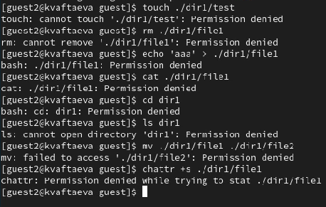

---
## Front matter
title: "Отчет по лабораторной работе №3"
subtitle: "Дисциплина: Информационная безопасность"
author: "Выполнила: Афтаева Ксения Васильевна"

## Generic otions
lang: ru-RU
toc-title: "Содержание"

## Bibliography
bibliography: bib/cite.bib
csl: pandoc/csl/gost-r-7-0-5-2008-numeric.csl

## Pdf output format
toc: true # Table of contents
toc-depth: 2
lof: true # List of figures
lot: true # List of tables
fontsize: 12pt
linestretch: 1.5
papersize: a4
documentclass: scrreprt
## I18n polyglossia
polyglossia-lang:
  name: russian
  options:
	- spelling=modern
	- babelshorthands=true
polyglossia-otherlangs:
  name: english
## I18n babel
babel-lang: russian
babel-otherlangs: english
## Fonts
mainfont: PT Serif
romanfont: PT Serif
sansfont: PT Sans
monofont: PT Mono
mainfontoptions: Ligatures=TeX
romanfontoptions: Ligatures=TeX
sansfontoptions: Ligatures=TeX,Scale=MatchLowercase
monofontoptions: Scale=MatchLowercase,Scale=0.9
## Biblatex
biblatex: true
biblio-style: "gost-numeric"
biblatexoptions:
  - parentracker=true
  - backend=biber
  - hyperref=auto
  - language=auto
  - autolang=other*
  - citestyle=gost-numeric
## Pandoc-crossref LaTeX customization
figureTitle: "Рис."
tableTitle: "Таблица"
listingTitle: "Листинг"
lofTitle: "Список иллюстраций"
lotTitle: "Список таблиц"
lolTitle: "Листинги"
## Misc options
indent: true
header-includes:
  - \usepackage{indentfirst}
  - \usepackage{float} # keep figures where there are in the text
  - \floatplacement{figure}{H} # keep figures where there are in the text
---

# Цель работы

Получение практических навыков работы в консоли с атрибутами файлов для групп пользователей.

# Задачи

1. Создать нового пользователя и добавить его в группу guest.
2. Заполнить таблицу «Установленные права и разрешённые действия для групп», выполняя действия от нового пользователя.
3. На основании заполненной таблицы определить те или иные минимально необходимые права для выполнения операций внутри директории от имени пользователей входящих в группу.

# Теоретическое введение

Изначально каждый файл имеет три параметра доступа [@key-1]:

 - **чтение** - разрешает прочитать содержимое файла или каталога (r);

 - **запись** - разрешает записывать новые данные в файл или изменять существующие, а также позволяет создавать и изменять файлы и каталоги (w);

 - **выполнение** - разрешает выполнять, как программу, и входить в директорию (x).

Каждый файл имеет три категории пользователей, для которых можно устанавливать различные сочетания прав доступа:

 - **владелец** - набор прав для владельца файла, пользователя, который его создал или сейчас установлен его владельцем;

 - **группа** - любая группа пользователей, существующая в системе и привязанная к файлу;

 - **остальные** - все пользователи, кроме владельца и пользователей, входящих в группу файла.

Информация о правах доступа к файлу представлена в виде **10** символов.
Первый символ определяет тип файла. Если первый символ ```-```, то это обычный файл. Если первый символ d, то это каталог.
Следующие 3 символа показывают разрешения для владельца. Буква означает наличие разрешения, а прочерк — его отсутствие.
Следующие 3 символа показывают разрешения для группы. Порядок записи разрешений всегда такой: чтение, запись, выполнение. 
Последние 3 символа показывают разрешения для всех остальных пользователей[@key-2]. 

Помимо буквенного указания атрибутов файлов, в Linux применяется также другой, более удобный метод обозначения прав доступа, при котором права обозначаются восьмеричным числом. Оно состоит из трех цифр, первая из которых обозначает право доступа для владельца файла, вторая – для группы владельца и третья – для всех остальных. Составить такое число несложно. Для каждого типа пользователей (владелец, группа владельца и другие пользователи) создается правило доступа в виде rwx, на месте каждого прочерка ставится ноль, а в остальных случаях – единица. Далее это переводится из двоичной системы счисления в восьмеричную [@key-3]. 

# Выполнение лабораторной работы

1. В прошлой лабораторной работе мы уже создали учетную запись пользователя guest и задали пароль.

2. Создала учётную запись пользователя guest2, используя учётную запись администратора, с помощью команды ```sudo useradd guest2``` (рис. @fig:001).

3. Задала пароль для пользователя guest2, используя учётную запись администратора, с помощью команды ```sudo passwd guest2``` (рис. @fig:001).

4. Добавила пользователя guest2 в группу guest командой ```sudo gpasswd -a guest2 guest``` (рис. @fig:001).

{#fig:001 width=70%}

5. Осуществила вход в систему от двух пользователей на двух разных консолях: guest на первой консоли (рис. @fig:002) и guest2 на второй консоли (рис. @fig:003).

6. Для обоих пользователей командой ```pwd``` определила директорию, в которой нахохожусь (рис. @fig:002-@fig:003). Видим, что оба пользователя находятся в своих домашних директориях. Имена директорий совпадают с именами пользователей в приглашениях командных строк.  Также в приглашениях видим знак ```~```, что означает, что мы находимся в домашней диретории пользователя.

7. Уточнила имена пользователей, введя команду ```whoami``` в консолях обоих пользователей (рис. @fig:002-@fig:003). Определила командами ```groups guest``` и ```groups guest2```, в какие группы входят пользователи guest и guest2 (рис. @fig:002-@fig:003). Видим, что пользователь guest входит в группу guest, а пользователь guest2 в группы guest и guest2. Также воспользовалась командами ```id -Gn``` и ```id -G``` для обоих пользователей (рис. @fig:002-@fig:003). Видим, что команда ```groups``` выводит только наименование групп, в которые входит пользователь. Аналогично и команда ```id -Gn```. Команда ```id -G``` выводит только идентификаторы групп.

{#fig:002 width=70%}

{#fig:003 width=70%}

8. Посмотрела файл /etc/group командой ```cat /etc/group``` (рис. @fig:004). Видим, что здесь выводится название группы, знак х вместо зашифрованного пароля, идентификатор группы и пользовтели, которые в нее входят. Здесь имя пользователя, чье имя совпадает с именем группы не указазывается в списке участников, хотя данный пользователь в группе состоит. 

{#fig:004 width=70%}

9. От имени пользователя guest2 выполнила регистрацию пользователя
guest2 в группе guest командой
```newgrp guest``` (рис. @fig:005).

{#fig:005 width=70%}

10. От имени пользователя guest изменила права директории /home/guest, разрешив все действия для пользователей группы командой
```chmod g+rwx /home/guest``` (рис. @fig:006).

11. От имени пользователя guest сняла с директории /home/guest/dir1 все атрибуты командой
```chmod 000 dir1``` (рис. @fig:006). Проверила правильность снятия атрибутов командой ```ls -l``` (рис. @fig:006). Видим, что все корректно. 

{#fig:006 width=70%}

12. Меняя атрибуты у директории dir1 и файла file1 от имени пользователя guest (рис. @fig:007) и делая проверку от пользователя guest2 (рис. @fig:008),  заполнила таблицу "Установленые права и разрешенные действия для групп". Для удобства восприятия разделила на 8 таблиц (таблицы @tbl:01 - @tbl:08) для каждого из вариантов прав для директории. При сравнении полученных таблиц и таблиц из лабораторной работы №2 можем заметить, что они одинаковы.  

{#fig:007 width=70%}

{#fig:008 width=70%}

: Права директории 000 {#tbl:01}

| Права файла                     | 000 | 010 | 020 | 030 | 040 | 050 | 060 | 070 |   
|---------------------------------|-----|-----|-----|-----|-----|-----|-----|-----|
| Создание файла                  |-    |-    |-    |-    |-    |-    |-    |-    |
| Создание файла                  |-    |-    |-    |-    |-    |-    |-    |-    |
| Запись в файл                   |-    |-    |-    |-    |-    |-    |-    |-    |
| Чтение файла                    |-    |-    |-    |-    |-    |-    |-    |-    |
| Смена директории                |-    |-    |-    |-    |-    |-    |-    |-    |
| Просмотр файлов в директории    |-    |-    |-    |-    |-    |-    |-    |-    |
| Переименование файла            |-    |-    |-    |-    |-    |-    |-    |-    |
| Смена атрибутов файла           |-    |-    |-    |-    |-    |-    |-    |-    |

: Права директории 010 {#tbl:02}

| Права файла                     | 000 | 010 | 020 | 030 | 040 | 050 | 060 | 070 |   
|---------------------------------|-----|-----|-----|-----|-----|-----|-----|-----|
| Создание файла                  |-    |-    |-    |-    |-    |-    |-    |-    |
| Создание файла                  |-    |-    |-    |-    |-    |-    |-    |-    |
| Запись в файл                   |-    |-    |+    |+    |-    |-    |+    |+    |
| Чтение файла                    |-    |-    |-    |-    |+    |+    |+    |+    |
| Смена директории                |+    |+    |+    |+    |+    |+    |+    |+    |
| Просмотр файлов в директории    |-    |-    |-    |-    |-    |-    |-    |-    |
| Переименование файла            |-    |-    |-    |-    |-    |-    |-    |-    |
| Смена атрибутов файла           |-    |-    |-    |-    |+    |+    |+    |+    |

: Права директории 020 {#tbl:03}

| Права файла                     | 000 | 010 | 020 | 030 | 040 | 050 | 060 | 070 |   
|---------------------------------|-----|-----|-----|-----|-----|-----|-----|-----|
| Создание файла                  |-    |-    |-    |-    |-    |-    |-    |-    |
| Создание файла                  |-    |-    |-    |-    |-    |-    |-    |-    |
| Запись в файл                   |-    |-    |-    |-    |-    |-    |-    |-    |
| Чтение файла                    |-    |-    |-    |-    |-    |-    |-    |-    |
| Смена директории                |-    |-    |-    |-    |-    |-    |-    |-    |
| Просмотр файлов в директории    |-    |-    |-    |-    |-    |-    |-    |-    |
| Переименование файла            |-    |-    |-    |-    |-    |-    |-    |-    |
| Смена атрибутов файла           |-    |-    |-    |-    |-    |-    |-    |-    |

: Права директории 030 {#tbl:04}

| Права файла                     | 000 | 010 | 020 | 030 | 040 | 050 | 060 | 070 |   
|---------------------------------|-----|-----|-----|-----|-----|-----|-----|-----|
| Создание файла                  |+    |+    |+    |+    |+    |+    |+    |+    |
| Создание файла                  |+    |+    |+    |+    |+    |+    |+    |+    |
| Запись в файл                   |-    |-    |+    |+    |-    |-    |+    |+    |
| Чтение файла                    |-    |-    |-    |-    |+    |+    |+    |+    |
| Смена директории                |+    |+    |+    |+    |+    |+    |+    |+    |
| Просмотр файлов в директории    |-    |-    |-    |-    |-    |-    |-    |-    |
| Переименование файла            |+    |+    |+    |+    |+    |+    |+    |+    |
| Смена атрибутов файла           |-    |-    |-    |-    |+    |+    |+    |+    |

: Права директории 040 {#tbl:05}

| Права файла                     | 000 | 010 | 020 | 030 | 040 | 050 | 060 | 070 |   
|---------------------------------|-----|-----|-----|-----|-----|-----|-----|-----|
| Создание файла                  |-    |-    |-    |-    |-    |-    |-    |-    |
| Создание файла                  |-    |-    |-    |-    |-    |-    |-    |-    |
| Запись в файл                   |-    |-    |-    |-    |-    |-    |-    |-    |
| Чтение файла                    |-    |-    |-    |-    |-    |-    |-    |-    |
| Смена директории                |-    |-    |-    |-    |-    |-    |-    |-    |
| Просмотр файлов в директории    |+    |+    |+    |+    |+    |+    |+    |+    |
| Переименование файла            |-    |-    |-    |-    |-    |-    |-    |-    |
| Смена атрибутов файла           |-    |-    |-    |-    |-    |-    |-    |-    |

: Права директории 050 {#tbl:06}

| Права файла                     | 000 | 010 | 020 | 030 | 040 | 050 | 060 | 070 |   
|---------------------------------|-----|-----|-----|-----|-----|-----|-----|-----|
| Создание файла                  |-    |-    |-    |-    |-    |-    |-    |-    |
| Создание файла                  |-    |-    |-    |-    |-    |-    |-    |-    |
| Запись в файл                   |-    |-    |+    |+    |-    |-    |+    |+    |
| Чтение файла                    |-    |-    |-    |-    |+    |+    |+    |+    |
| Смена директории                |+    |+    |+    |+    |+    |+    |+    |+    |
| Просмотр файлов в директории    |+    |+    |+    |+    |+    |+    |+    |+    |
| Переименование файла            |-    |-    |-    |-    |-    |-    |-    |-    |
| Смена атрибутов файла           |-    |-    |-    |-    |+    |+    |+    |+    |

: Права директории 060 {#tbl:07}

| Права файла                     | 000 | 010 | 020 | 030 | 040 | 050 | 060 | 070 |   
|---------------------------------|-----|-----|-----|-----|-----|-----|-----|-----|
| Создание файла                  |-    |-    |-    |-    |-    |-    |-    |-    |
| Создание файла                  |-    |-    |-    |-    |-    |-    |-    |-    |
| Запись в файл                   |-    |-    |-    |-    |-    |-    |-    |-    |
| Чтение файла                    |-    |-    |-    |-    |-    |-    |-    |-    |
| Смена директории                |-    |-    |-    |-    |-    |-    |-    |-    |
| Просмотр файлов в директории    |+    |+    |+    |+    |+    |+    |+    |+    |
| Переименование файла            |-    |-    |-    |-    |-    |-    |-    |-    |
| Смена атрибутов файла           |-    |-    |-    |-    |-    |-    |-    |-    |

: Права директории 070 {#tbl:08}

| Права файла                     | 000 | 010 | 020 | 030 | 040 | 050 | 060 | 070 |   
|---------------------------------|-----|-----|-----|-----|-----|-----|-----|-----|
| Создание файла                  |+    |+    |+    |+    |+    |+    |+    |+    |
| Создание файла                  |+    |+    |+    |+    |+    |+    |+    |+    |
| Запись в файл                   |-    |-    |+    |+    |-    |-    |+    |+    |
| Чтение файла                    |-    |-    |-    |-    |+    |+    |+    |+    |
| Смена директории                |+    |+    |+    |+    |+    |+    |+    |+    |
| Просмотр файлов в директории    |+    |+    |+    |+    |+    |+    |+    |+    |
| Переименование файла            |+    |+    |+    |+    |+    |+    |+    |+    |
| Смена атрибутов файла           |-    |-    |-    |-    |+    |+    |+    |+    |

13. На основании заполненных таблиц определила те или иные минимально необходимые права для выполнения операций внутри директории (таблица @tbl:09)

: Минимальные права для совершения операций от имени пользователей, входящих в группу {#tbl:09}

|Операция                |Минимальные права на директорию|Минимальные права на файл|
|------------------------|-------------------------------|-------------------------|
|Создание файла          |030                            |000                      |
|Удаление файла          |030                            |000                      |
|Чтение файла            |010                            |040                      |
|Запись в файл           |010                            |020                      |
|Переименование файла    |030                            |000                      |
|Создание поддиректории  |030                            |000                      |
|Удаление поддиректории  |030                            |000                      |

# Выводы

Я получила практические навыки работы в консоли с атрибутами файлов для групп пользователей.

# Список литературы{.unnumbered}

::: {#refs}
:::
