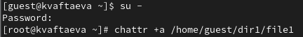
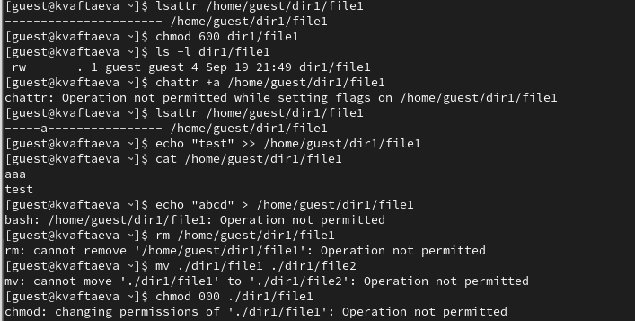
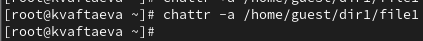
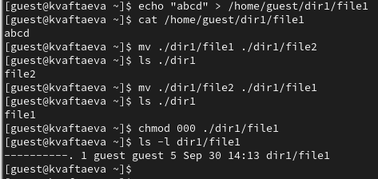
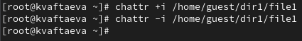
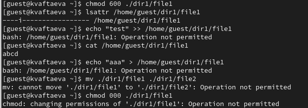
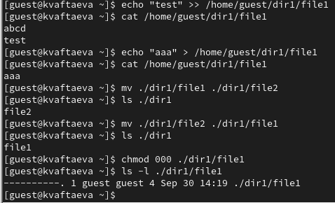

---
## Front matter
lang: ru-RU
title: Лабораторная работа №4
subtitle: Дискреционное разграничение прав в Linux. Расширенные атрибуты
author:
  - Афтаева К.В.
institute:
  - Российский университет дружбы народов им. Патриса Лумумбы, Москва, Россия
date: 30 сентября 2023

## i18n babel
babel-lang: russian
babel-otherlangs: english

## Formatting pdf
toc: false
toc-title: Содержание
slide_level: 2
aspectratio: 169
section-titles: true
theme: metropolis
header-includes:
 - \metroset{progressbar=frametitle,sectionpage=progressbar,numbering=fraction}
 - '\makeatletter'
 - '\beamer@ignorenonframefalse'
 - '\makeatother'
---

# Информация

## Докладчик

:::::::::::::: {.columns align=center}
::: {.column width="70%"}

  * Афтаева Ксения Васильевна
  * студент группы НПИбд-01-20
  * Российский университет дружбы народов им. Патриса Лумумбы
  * [1032201739@pfur.ru](mailto:1032201739@pfur.ru)
  * <https://github.com/KVAftaeva/study_2023-2024_infosec>

:::
::: {.column width="30%"}

:::
::::::::::::::

# Вводная часть

## Актуальность

- Система прав доступа к файлам является одной из самых важных в операционной системе Linux

## Объект и предмет исследования

- ОС Linux
- Механизм разграничения прав доступа

## Цели и задачи

- Проделать действия по работе с атрибутом "a", занося наблюдения в отчет
- Проделать действия по работе с атрибутом "i", занося наблюдения в отчет

## Материалы и методы

- Механизм разграничения прав доступа в ОС Linux

# Выполнение работы

## Работа с расширенным атрибутом a

{width=70%}

{width=70%}

## Работа с расширенным атрибутом a (после снятия атрибута)

{width=70%}

{width=70%}

## Работа с расширенным атрибутом i

{width=70%}

{width=70%}

## Работа с расширенным атрибутом i (после снятия атрибута)

{width=70%}

{width=70%}

# Результаты

## Результат

- проделаны действия, по изучению прав доступа в ОС Linux
- проделаны действия по работе с расширенными атрибутами "a" и "i"
- получены практические навыки по работе с расширенными атрибутами

# Вывод

## Вывод

Я получила практические навыки работы в консоли с расширенными атрибутами файлов. Опробовалf на практике действие расширенных атрибутов «а» и «i».