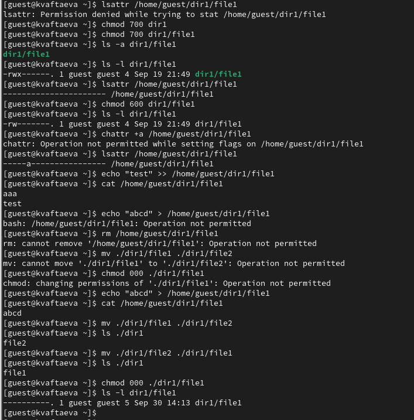
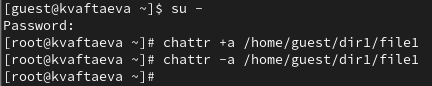
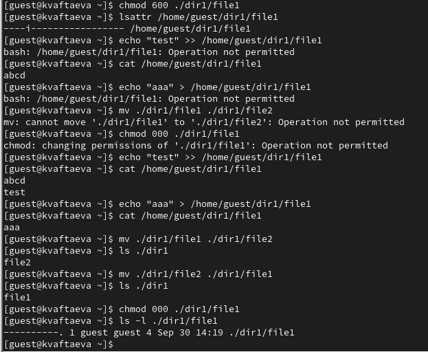
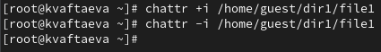

---
## Front matter
title: "Отчет по лабораторной работе №4"
subtitle: "Дисциплина: Информационная безопасность"
author: "Выполнила: Афтаева Ксения Васильевна"

## Generic otions
lang: ru-RU
toc-title: "Содержание"

## Bibliography
bibliography: bib/cite.bib
csl: pandoc/csl/gost-r-7-0-5-2008-numeric.csl

## Pdf output format
toc: true # Table of contents
toc-depth: 2
lof: true # List of figures
lot: true # List of tables
fontsize: 12pt
linestretch: 1.5
papersize: a4
documentclass: scrreprt
## I18n polyglossia
polyglossia-lang:
  name: russian
  options:
	- spelling=modern
	- babelshorthands=true
polyglossia-otherlangs:
  name: english
## I18n babel
babel-lang: russian
babel-otherlangs: english
## Fonts
mainfont: PT Serif
romanfont: PT Serif
sansfont: PT Sans
monofont: PT Mono
mainfontoptions: Ligatures=TeX
romanfontoptions: Ligatures=TeX
sansfontoptions: Ligatures=TeX,Scale=MatchLowercase
monofontoptions: Scale=MatchLowercase,Scale=0.9
## Biblatex
biblatex: true
biblio-style: "gost-numeric"
biblatexoptions:
  - parentracker=true
  - backend=biber
  - hyperref=auto
  - language=auto
  - autolang=other*
  - citestyle=gost-numeric
## Pandoc-crossref LaTeX customization
figureTitle: "Рис."
tableTitle: "Таблица"
listingTitle: "Листинг"
lofTitle: "Список иллюстраций"
lotTitle: "Список таблиц"
lolTitle: "Листинги"
## Misc options
indent: true
header-includes:
  - \usepackage{indentfirst}
  - \usepackage{float} # keep figures where there are in the text
  - \floatplacement{figure}{H} # keep figures where there are in the text
---

# Цель работы

Получение практических навыков работы в консоли с расширенными атрибутами файлов.

# Задачи

1. Проделать действия по работе с атрибутом "a", занося наблюдения в отчет.
2. Проделать действия по работе с атрибутом "i", занося наблюдения в отчет.

# Теоретическое введение

Изначально каждый файл имеет три параметра доступа [@key-1]:

 - **чтение** - разрешает прочитать содержимое файла или каталога (r);

 - **запись** - разрешает записывать новые данные в файл или изменять существующие, а также позволяет создавать и изменять файлы и каталоги (w);

 - **выполнение** - разрешает выполнять, как программу, и входить в директорию (x).

Каждый файл имеет три категории пользователей, для которых можно устанавливать различные сочетания прав доступа:

 - **владелец** - набор прав для владельца файла, пользователя, который его создал или сейчас установлен его владельцем;

 - **группа** - любая группа пользователей, существующая в системе и привязанная к файлу;

 - **остальные** - все пользователи, кроме владельца и пользователей, входящих в группу файла.

Информация о правах доступа к файлу представлена в виде **10** символов.
Первый символ определяет тип файла. Если первый символ ```-```, то это обычный файл. Если первый символ d, то это каталог.
Следующие 3 символа показывают разрешения для владельца. Буква означает наличие разрешения, а прочерк — его отсутствие.
Следующие 3 символа показывают разрешения для группы. Порядок записи разрешений всегда такой: чтение, запись, выполнение. 
Последние 3 символа показывают разрешения для всех остальных пользователей[@key-2]. 

Помимо прав доступа каждый из файлов стандартной файловой системы Linux имеет набор атрибутов, регламентирующих особенности работы с ним. 

Команда chattr позволяет устанавливать и отключать атрибуты файлов, на уровне файловой системы не зависимо от стандартных (чтение, запись, выполнение) [@key-3].

Основные опции утилиты:

- R - рекурсивная обработка каталога;
- V - максимально подробный вывод;
- f - игнорировать сообщения об ошибках;
- v - вывести версию.

Оператор может принимать значения:

- `+` - включить выбранные атрибуты;
- `-` - отключить выбранные атрибуты;
- `=` - оставить значение атрибута таким, каким оно было у файла.

Некоторые доступные атрибуты:

- a - файл может быть открыт только в режиме добавления;
- A - не обновлять время перезаписи;
- c - автоматически сжимать при записи на диск;
- C - отключить копирование при записи;
- D - работает только для папки, когда установлен, все изменения синхронно записываются на диск сразу же;
- e - использовать extent'ы блоков для хранения файла;
- i - сделать неизменяемым;
- j - все данные перед записью в файл будут записаны в журнал;
- s - безопасное удаление с последующей перезаписью нулями;
- S - синхронное обновление, изменения файлов с этим атрибутом будут сразу же записаны на диск;
- t - файлы с этим атрибутом не будут хранится в отдельных блоках;
- u - содержимое файлов с этим атрибутом не будет удалено при удалении самого файла и потом может быть восстановлено.

# Выполнение лабораторной работы

1. В прошлой лабораторной работе на данный каталог и файл для владельца мы установили права доступа "---". Изменила права доступа на каталог и файл на 700, чтобы следущее действие было возможным для выполнения от лица владельца (рис. @fig:001).

2. От имени пользователя guest определила расширенные атрибуты файла
/home/guest/dir1/file1 командой ```lsattr /home/guest/dir1/file1``` (рис. @fig:001). Видим, что никаких расширенных атрибутов не установлено. 

3. Установила командой ```chmod 600 ./dir1/file1``` на файл file1 права, разрешающие чтение и запись для владельца файла (рис. @fig:001).

4. Попробовала установить на файл /home/guest/dir1/file1 расширенный атрибут a от имени пользователя guest командой ```chattr +a /home/guest/dir1/file1``` (рис. @fig:001). В ответ мы получили отказ от выполнения операции.

5. Повысила свои права с помощью команды ```su -``` в отдельном терминале(рис. @fig:002). Попробовала установить расширенный атрибут a на файл /home/guest/dir1/file1 от имени суперпользователя командой ```chattr +a /home/guest/dir1/file1``` (рис. @fig:002). 

6. От пользователя guest проверила правильность установления атрибута командой ```lsattr /home/guest/dir1/file1``` (рис. @fig:001). Видим, что атрибут установлен верно.

7.  Выполнила дозапись в файл file1 слова «test» командой ```echo "test" >> /home/guest/dir1/file1``` (рис. @fig:001). Видим, что выполнить дозапись удалось. После этого выполнила чтение файла file1 командой ```cat /home/guest/dir1/file1``` (рис. @fig:001). Нам вывелось содержимое файла.

8. Попробовала стереть информацию из файла file1 перезаписав содержимое командой ```echo "abcd" > /home/guest/dir1/file``` (рис. @fig:001). Попробовала переименовать файл file1 командой ```mv ./dir1/file1 ./dir1/file2``` (рис. @fig:001). Видим, что выполнить оба этих действия не удалось. 

9. Попробовала с помощью команды ```chmod 000 ./dir1/file1```
установить на файл file1 права, запрещающие чтение, запись и исполнение для владельца файла (рис. @fig:001). Сделать это не удалось.

10. Сняла расширенный атрибут a с файла /home/guest/dirl/file1 от
имени суперпользователя командой ```chattr -a /home/guest/dir1/file1``` (рис. @fig:002). Повторила от лица пользователя guest операции, которые ранее не удавалось выполнить (рис. @fig:001). Видим, что теперь можем выполнить все действия.

{#fig:001 width=70%}

{#fig:002 width=70%}

11. Установила командой ```chmod 600 ./dir1/file1``` на файл file1 права, разрешающие чтение и запись для владельца файла (рис. @fig:003). 

12. Установила расширенный атрибут i на файл /home/guest/dir1/file1 от имени суперпользователя командой ```chattr +i /home/guest/dir1/file1``` (рис. @fig:004). 

13. От пользователя guest проверила правильность установления атрибута командой ```lsattr /home/guest/dir1/file1``` (рис. @fig:003). Видим, что атрибут установлен верно.

14.  Выполнила дозапись в файл file1 слова «test» командой ```echo "test" >> /home/guest/dir1/file1``` (рис. @fig:003). Сделать это не удалось. После этого выполнила чтение файла file1 командой ```cat /home/guest/dir1/file1``` (рис. @fig:003). Нам вывелось содержимое файла.

15. Попробовала стереть информацию из файла file1 перезаписав содержимое командой ```echo "aaa" > /home/guest/dir1/file``` (рис. @fig:003). Попробовала переименовать файл file1 командой ```mv ./dir1/file1 ./dir1/file2``` (рис. @fig:003). Оба этих действия выполнить не удалось.

16. Попробовала с помощью команды ```chmod 000 ./dir1/file1```
установить на файл file1 права, запрещающие чтение, запись и исполнение для владельца файла (рис. @fig:003). Выполнить данное действие не удалось.

17. Сняла расширенный атрибут i с файла /home/guest/dirl/file1 от
имени суперпользователя командой ```chattr -i /home/guest/dir1/file1``` (рис. @fig:004). Повторила от лица пользователя guest операции, которые ранее не удавалось выполнить (рис. @fig:003). Теперь всe действия выполнить получилось.

{#fig:003 width=70%}

{#fig:004 width=70%}

# Выводы

Я получила практические навыки работы в консоли с расширенными атрибутами файлов. Опробовала на практике действие расширенных атрибутов «а» и «i».

# Список литературы{.unnumbered}

::: {#refs}
:::
