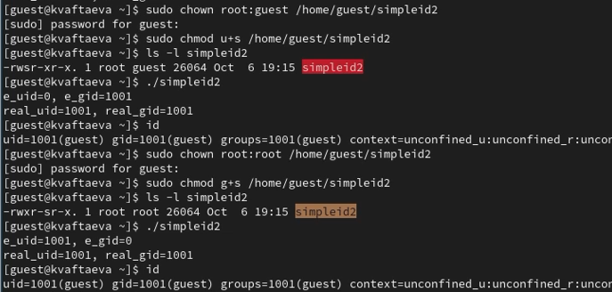
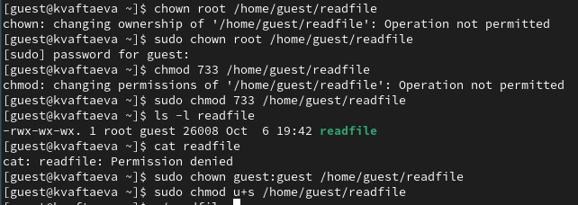
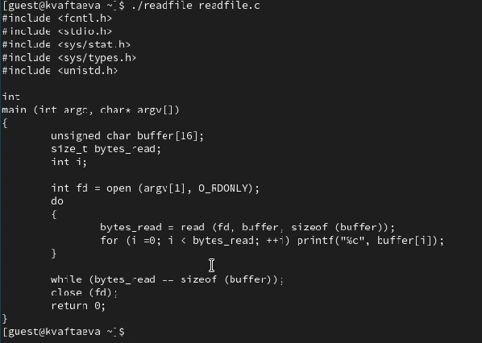
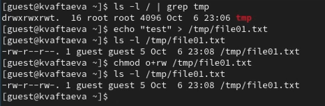
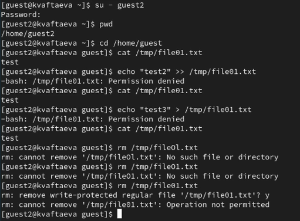
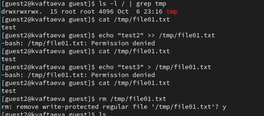

---
## Front matter
lang: ru-RU
title: Лабораторная работа №5
subtitle: Дискреционное разграничение прав в Linux. Исследование влияния дополнительных атрибутов
author:
  - Афтаева К.В.
institute:
  - Российский университет дружбы народов им. Патриса Лумумбы, Москва, Россия
date: 7 октября 2023

## i18n babel
babel-lang: russian
babel-otherlangs: english

## Formatting pdf
toc: false
toc-title: Содержание
slide_level: 2
aspectratio: 169
section-titles: true
theme: metropolis
header-includes:
 - \metroset{progressbar=frametitle,sectionpage=progressbar,numbering=fraction}
 - '\makeatletter'
 - '\beamer@ignorenonframefalse'
 - '\makeatother'
---

# Информация

## Докладчик

:::::::::::::: {.columns align=center}
::: {.column width="70%"}

  * Афтаева Ксения Васильевна
  * студент группы НПИбд-01-20
  * Российский университет дружбы народов им. Патриса Лумумбы
  * [1032201739@pfur.ru](mailto:1032201739@pfur.ru)
  * <https://github.com/KVAftaeva/study_2023-2024_infosec>

:::
::: {.column width="30%"}

:::
::::::::::::::

# Вводная часть

## Актуальность

- Система прав доступа к файлам является одной из самых важных в операционной системе Linux

## Объект и предмет исследования

- ОС Linux
- Механизм изменения идентификаторов
- SetUID-, SetGID-, Sticky-биты

## Цели и задачи

1. Подготовить лабораторный стенд, если это требуется.
2. Выполнить задания по созданию и компилированию программ.
3. Выполнить задания по исследованию Sticky-бита.

## Материалы и методы

- Механизм изменения идентификаторов в ОС Linux

# Выполнение работы

## Исследование SetUID- и SetGID-битов

{width=70%}

## Работа с файлом readfile.c

{width=70%}

## Проверка возможности чтения файла

{width=70%}

## Проверка наличия Sticky-бита

{width=70%}

## Проверка возможных действий (со Sticky-битом)

{width=70%}

## Проверка возможных действий (без Sticky-бита)

{width=70%}

# Результаты

## Результат

1. Выполнены задания по созданию и компилированию программ. Изучены механизмы применения SetUID- и SetGID-битов.
2. Выполнены задания по исследованию Sticky-бита.

# Вывод

## Вывод

Я изучила механизмы изменения, применения SetUID- и Sticky-битов. Получила практические навыки работы в консоли с дополнительными атрибутами. Рассмотрела работу механизма смены идентификатора процессов пользователей, а также влияние бита Sticky на запись и удаление файлов.