---
## Front matter
lang: ru-RU
title: Лабораторная работа №6
subtitle: Мандатное разграничение прав в Linux
author:
  - Афтаева К.В.
institute:
  - Российский университет дружбы народов им. Патриса Лумумбы, Москва, Россия
date: 14 октября 2023

## i18n babel
babel-lang: russian
babel-otherlangs: english

## Formatting pdf
toc: false
toc-title: Содержание
slide_level: 2
aspectratio: 169
section-titles: true
theme: metropolis
header-includes:
 - \metroset{progressbar=frametitle,sectionpage=progressbar,numbering=fraction}
 - '\makeatletter'
 - '\beamer@ignorenonframefalse'
 - '\makeatother'
---

# Информация

## Докладчик

:::::::::::::: {.columns align=center}
::: {.column width="70%"}

  * Афтаева Ксения Васильевна
  * студент группы НПИбд-01-20
  * Российский университет дружбы народов им. Патриса Лумумбы
  * [1032201739@pfur.ru](mailto:1032201739@pfur.ru)
  * <https://github.com/KVAftaeva/study_2023-2024_infosec>

:::
::: {.column width="30%"}

:::
::::::::::::::

# Вводная часть

## Актуальность

- Система прав доступа к файлам является одной из самых важных в операционной системе Linux

## Объект и предмет исследования

- ОС Linux
- технология SELinux

## Цели и задачи

1. Подготовить лабораторный стенд
2. Ознакомиться с технологией SELinux
3. Выполнить задания по работе с SELinux совместно с веб-сервером Apache

## Материалы и методы

- Технология SELinux

# Выполнение работы

## Подготовка лабораторного стенда

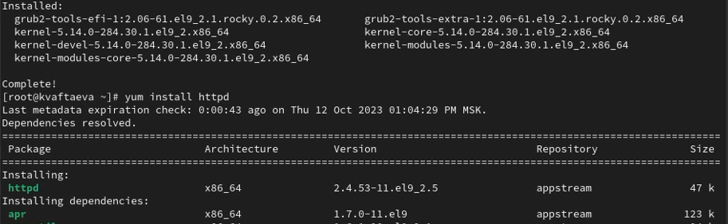{width=70%}

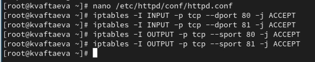{width=70%}

## Режим и политика SELinux

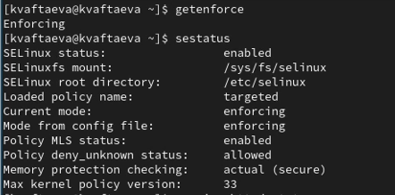{width=70%}

## Доступ к файлу через веб-сервер

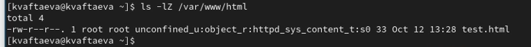{width=70%}

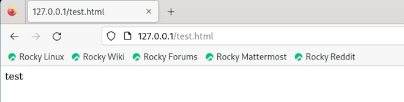{width=70%}

## Отсутствие доступа к файлу через веб-сервер

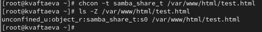{width=70%}

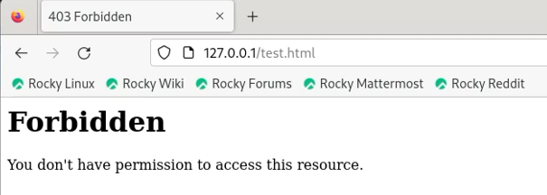{width=70%}

## Смена порта

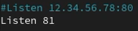{width=40%}

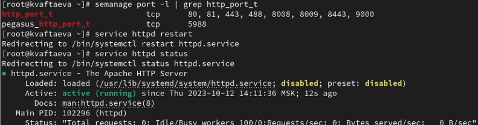{width=70%}

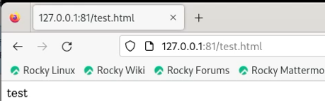{width=70%}

## Удаление файла

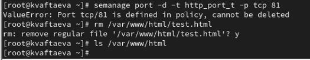{width=70%}

# Результаты

## Результат

1. Изучена технология SELinux
2. Проверена работа SELinx на практике совместно с веб-сервером
Apache

# Вывод

## Вывод

Я развила навыки администрирования ОС Linux. Получила первое практическое знакомство с технологией SELinux. Проверила работу SELinux на практике совместно с веб-сервером
Apache.