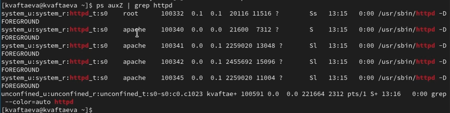

---
## Front matter
title: "Отчет по лабораторной работе №6"
subtitle: "Дисциплина: Информационная безопасность"
author: "Выполнила: Афтаева Ксения Васильевна"

## Generic otions
lang: ru-RU
toc-title: "Содержание"

## Bibliography
bibliography: bib/cite.bib
csl: pandoc/csl/gost-r-7-0-5-2008-numeric.csl

## Pdf output format
toc: true # Table of contents
toc-depth: 2
lof: true # List of figures
lot: true # List of tables
fontsize: 12pt
linestretch: 1.5
papersize: a4
documentclass: scrreprt
## I18n polyglossia
polyglossia-lang:
  name: russian
  options:
	- spelling=modern
	- babelshorthands=true
polyglossia-otherlangs:
  name: english
## I18n babel
babel-lang: russian
babel-otherlangs: english
## Fonts
mainfont: PT Serif
romanfont: PT Serif
sansfont: PT Sans
monofont: PT Mono
mainfontoptions: Ligatures=TeX
romanfontoptions: Ligatures=TeX
sansfontoptions: Ligatures=TeX,Scale=MatchLowercase
monofontoptions: Scale=MatchLowercase,Scale=0.9
## Biblatex
biblatex: true
biblio-style: "gost-numeric"
biblatexoptions:
  - parentracker=true
  - backend=biber
  - hyperref=auto
  - language=auto
  - autolang=other*
  - citestyle=gost-numeric
## Pandoc-crossref LaTeX customization
figureTitle: "Рис."
tableTitle: "Таблица"
listingTitle: "Листинг"
lofTitle: "Список иллюстраций"
lotTitle: "Список таблиц"
lolTitle: "Листинги"
## Misc options
indent: true
header-includes:
  - \usepackage{indentfirst}
  - \usepackage{float} # keep figures where there are in the text
  - \floatplacement{figure}{H} # keep figures where there are in the text
---

# Цель работы

Развить навыки администрирования ОС Linux. Получить первое практическое знакомство с технологией SELinux. Проверить работу SELinux на практике совместно с веб-сервером
Apache.


# Задачи

1. Подготовить лабораторный стенд.
2. Ознакомиться с технологией SELinux.
3. Выполнить задания по работе с SELinux совместно с веб-сервером Apache.

# Теоретическое введение

**SELinux** — это система принудительного контроля доступа, реализованная на уровне ядра [@key-1].

SELinux имеет три основных режима работы, при этом по умолчанию установлен режим Enforcing. Это довольно жесткий режим, и в случае необходимости он может быть изменен на более удобный для конечного пользователя.

**Enforcing**: Режим по-умолчанию. При выборе этого режима все действия, которые каким-то образом нарушают текущую политику безопасности, будут блокироваться, а попытка нарушения будет зафиксирована в журнале.

**Permissive**: В случае использования этого режима, информация о всех действиях, которые нарушают текущую политику безопасности, будут зафиксированы в журнале, но сами действия не будут заблокированы.

**Disabled**: Полное отключение системы принудительного контроля доступа.

Политики SELinux бывают тоже нескольких типов [@key-2]. Могут использоваться три основные политики:

- **targeted** - защищает основные системные сервисы, например, веб-сервер, DHCP, DNS, но не трогает все остальные программы;

- **strict** - самая строгая политика, управляет не только сетевыми службами, но и программами пользователя;

- **mls** - содержит не только правила, но и различные уровни безопасности; она позволяет реализовать многоуровневую систему безопасности на основе SELinux.

Также можно добавить свои политики.

Все процессы и файлы в рамках SELinux имеют контекст безопасности.

**Apache** – это свободное программное обеспечение для размещения веб-сервера [@key-3]. Он хорошо показывает себя в работе с масштабными проектами, поэтому заслуженно считается одним из самых популярных веб-серверов. Кроме того, Apache очень гибок в плане настройки, что даёт возможность реализовать все особенности размещаемого веб-ресурса.

Система конфигурации Apache работает на текстовых файлах с прописанными настройками. Она подразделяется на три условных уровня, для каждого из которых имеется свой конфигурационный файл:

1. Уровень конфигурации сервера (файл httpd.conf) – основной конфигурационный файл. Действие распространяется на весь механизм веб-сервера.

2. Уровень каталога (файл .htaccess) – дополнительный конфигурационный файл. Его директивы охватывают только каталог, где расположен файл, а также вложенные подкаталоги.

3. Уровень виртуального хоста (файл httpd.conf> или extra/httpd-vhosts.conf).

Обычно конфигурационные файлы Apache находятся в папке «conf», а дополнительные конфигурационные файлы во вложенной в нее папке «extra». Внести изменения можно как через редактирование самого файла, так и через командную строку.

# Выполнение лабораторной работы

## Подготовка лабораторного стенда 

1. Посмотрела конфигурационный файл /etc/selinux/config, чтобы проверить используемый режим и политику (рис. @fig:001). Видим, что установлены политика targeted и режим enforcing, поэтому специальных настроек не требуется.

{#fig:001 width=70%}

2. Обновила систему командой ```yum update``` (рис. @fig:002 - @fig:003). После этого, установила веб-сервер Apache командой ```yum install httpd``` (рис. @fig:003 - @fig:004). Видим, что все установилось успешно.

{#fig:002 width=70%}

{#fig:003 width=70%}

{#fig:004 width=70%}

3. Задала в конфигурационном файле /etc/httpd/conf/httpd.conf параметр ```ServerName test.ru``` чтобы при запуске веб-сервера не выдавались лишние сообщения об ошибках, не относящихся к лабораторной работе (рис. @fig:005).

{#fig:005 width=70%}

4. Чтобы пакетный фильтр в своей рабочей конфигурации позволял подключаться к 80-у и 81-у
портам протокола tcp, добавила разрешающие правила (рис. @fig:006):
```
iptables -I INPUT -p tcp --dport 80 -j ACCEPT
iptables -I INPUT -p tcp --dport 81 -j ACCEPT
iptables -I OUTPUT -p tcp --sport 80 -j ACCEPT
iptables -I OUTPUT -p tcp --sport 81 -j ACCEPT
```

{#fig:006 width=70%}

## Работа с SELinux и Apache

1. Вошла в систему и убедилась, что SELinux работает в режиме enforcing политики targeted с помощью команд ```getenforce``` и ```sestatus``` (рис. @fig:007). 

{#fig:007 width=70%}

2. Обратилась с помощью браузера к веб-серверу, запущенному на моем компьютере, с помощью команды ```service httpd status``` (рис. @fig:008). Видим, что он не работает. Запустила его с помощью команды ```service httpd start``` (рис. @fig:008). Убедилась, что он работает с помощью команды ```service httpd status``` (рис. @fig:008).

{#fig:008 width=70%}

3. Нашла веб-сервер Apache в списке процессов командой ```ps auxZ | grep httpd``` (рис. @fig:009).  Видим, что контекст безопасности здесь system_u:system_r:httpd_t:s0. Контекст безопасности состоит из четырех полей: пользователь, роль, тип и уровень.  

{#fig:009 width=70%}

4. Посмотрела текущее состояние переключателей SELinux для Apache с помощью команды ```sestatus -b | grep httpd``` (рис. @fig:010). Видим, что большие из них находятся в положении «off».

{#fig:010 width=70%}

5. Посмотрела статистику по политике с помощью команды ```seinfo``` (рис. @fig:011). Видим, что пользователей 8, типов 5100, ролей 14.

{#fig:011 width=70%}

6. Посмотрела содержимое директории /var/www, с помощью команды
```ls -lZ /var/www``` (рис. @fig:012). Видим, что здесь находятся две папки, с типами httpd_sys_script_exec_t и httpd_sys_content_t. 

7. Посмотрела содержимое директории /var/www/html, командой ```ls -lZ /var/www/html``` (рис. @fig:012). Видим, что папка пуста.

8. Определила круг пользователей, которым разрешено создание файлов в директории /var/www/html. Создавать файлы может только владелец (root)

{#fig:012 width=70%}

9. Создала от имени суперпользователя (так как в дистрибутиве после установки только ему разрешена запись в директорию) html-файл
/var/www/html/test.html следующего содержания (рис. @fig:013):
```
<html>
<body>test</body>
</html>
```

{#fig:013 width=70%}

10. Проверила контекст созданного файла. Видим, что контекст,
присваиваемый по умолчанию вновь созданным файлам в директории /var/www/html - unconfined_u:object_r:httpd_sys_content_t:s0 (рис. @fig:014).

{#fig:014 width=70%}

11. Обратилась к файлу через веб-сервер, введя в браузере адрес
http://127.0.0.1/test.html (рис. @fig:015). Видим, что файл был успешно отображён.

{#fig:015 width=70%}

12. Изучила справочную информацию. SELinux требует наличия у файлов расширенных атрибутов, определяющих тип файла. Для httpd определены следующие контексты файлов:

- httpd_sys_content_t 

- httpd_sys_script_exec_t  

- httpd_sys_script_ro_t 

- httpd_sys_script_rw_t 

- httpd_sys_script_ra_t 

- httpd_unconfined_script_exec_t  

  Проверила контекст файла командой ```ls -Z /var/www/html/test.html``` (рис. @fig:016). Видим, что здесь httpd_sys_content_t, то есть содержимое должно быть доступно для всех скриптов httpd и для самого демона. Рассмотрим полученный контекст детально. Так
как по умолчанию пользователи CentOS являются свободными от типа
(unconfined в переводе с англ. означает свободный), созданному нами
файлу test.html был сопоставлен SELinux, пользователь unconfined_u.
Это первая часть контекста.
Далее политика ролевого разделения доступа RBAC используется процессами, но не файлами, поэтому роли не имеют никакого значения для
файлов. Роль object_r используется по умолчанию для файлов на «постоянных» носителях и на сетевых файловых системах. Тип httpd_sys_content_t позволяет процессу httpd получить доступ к файлу. Благодаря наличию последнего типа мы получили доступ к файлу
при обращении к нему через браузер.

{#fig:016 width=70%}

13. Изменила контекст файла /var/www/html/test.html с httpd_sys_content_t на samba_share_t, к которому процесс httpd не имеет доступа, командой ```chcon -t samba_share_t /var/www/html/test.html``` (рис. @fig:017). Затем проверила, что контекст поменялся командой ```ls -Z /var/www/html/test.html``` (рис. @fig:017).

{#fig:017 width=70%}

14. Попробовала ещё раз получить доступ к файлу через веб-сервер, введя в
браузере адрес http://127.0.0.1/test.html (рис. @fig:018). Получено сообщение об ошибке. 

{#fig:018 width=70%}

15. Файл не был отображен из-за недопустимого для httpd контекста безопасности, несмотря на то, что права доступа позволяют читать этот файл (рис. @fig:019). Просмотрела системный лог-файл командой ```tail /var/log/messages``` (рис. @fig:020). Процессы setroubleshootd и audtd не запущены.

{#fig:019 width=70%}

{#fig:020 width=70%}

16. Попробовала запустить веб-сервер Apache на прослушивание ТСР-порта 81. Для
этого в файле /etc/httpd/conf/httpd.conf заменила строчку Listen 80 на Listen 81 (рис. @fig:021).

{#fig:021 width=70%}

17. Выполнила перезапуск веб-сервера Apache командой ```service httpd restart``` (рис. @fig:022). Сбоя не произошло, так как возможность прослушивания 81 порта была прописана в виде разрешающих правил в разделе подготовки стенда.

{#fig:022 width=70%}

18. Проанализировала лог-файлы (команда ```tail -nl /var/log/messages```) (рис. @fig:023). Просмотрела файлы /var/log/http/error_log (рис. @fig:023), /var/log/http/access_log (рис. @fig:023) и /var/log/audit/audit.log (рис. @fig:024). Нигде нет записей об ошибках, так как ошибки не было.

{#fig:023 width=70%}

{#fig:024 width=70%}

19. Проверила список портов командой
```semanage port -l | grep http_port_t``` (рис. @fig:025). 
Видим, что порт 81 есть в списке.

20. Запустила веб-сервер Apache ещё раз (рис. @fig:025). Он снова успешно запустился, так как мы ничего и не меняли (рис. @fig:025). Он запустился и в первый и во второй раз, так как порт 81 был в списке портов. 

21. Вернула контекст httpd_sys_cоntent__t к файлу /var/www/html/ test.html командой ```chcon -t httpd_sys_content_t /var/www/html/test.html``` (рис. @fig:025). 
После этого попробовала получить доступ к файлу через веб-сервер, введя в браузере адрес http://127.0.0.1:81/test.html (рис. @fig:026). Видим содержимое файла — слово «test».

{#fig:025 width=70%}

{#fig:026 width=70%}

22. Исправила обратно конфигурационный файл apache, вернув Listen 80 (рис. @fig:027).

{#fig:027 width=70%}

23. Удалить привязку к порту командой ```semanage port -d -t http_port_t -p tcp 81``` не удалось, так как она определена в политике (рис. @fig:028). Исправлять это я не стала, сделаю это при необходимости позже. 

24. Удалила файл /var/www/html/test.html командой ```rm /var/www/html/test.html``` (рис. @fig:028).

{#fig:028 width=70%}

# Выводы

Я развила навыки администрирования ОС Linux. Получила первое практическое знакомство с технологией SELinux. Проверила работу SELinux на практике совместно с веб-сервером
Apache.

# Список литературы{.unnumbered}

::: {#refs}
:::
