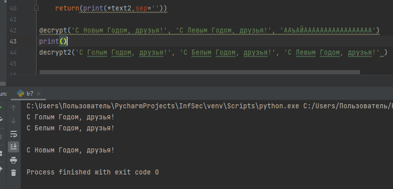

---
## Front matter
title: "Отчет по лабораторной работе №8"
subtitle: "Дисциплина: Информационная безопасность"
author: "Выполнила: Афтаева Ксения Васильевна"

## Generic otions
lang: ru-RU
toc-title: "Содержание"

## Bibliography
bibliography: bib/cite.bib
csl: pandoc/csl/gost-r-7-0-5-2008-numeric.csl

## Pdf output format
toc: true # Table of contents
toc-depth: 2
lof: true # List of figures
lot: true # List of tables
fontsize: 12pt
linestretch: 1.5
papersize: a4
documentclass: scrreprt
## I18n polyglossia
polyglossia-lang:
  name: russian
  options:
	- spelling=modern
	- babelshorthands=true
polyglossia-otherlangs:
  name: english
## I18n babel
babel-lang: russian
babel-otherlangs: english
## Fonts
mainfont: PT Serif
romanfont: PT Serif
sansfont: PT Sans
monofont: PT Mono
mainfontoptions: Ligatures=TeX
romanfontoptions: Ligatures=TeX
sansfontoptions: Ligatures=TeX,Scale=MatchLowercase
monofontoptions: Scale=MatchLowercase,Scale=0.9
## Biblatex
biblatex: true
biblio-style: "gost-numeric"
biblatexoptions:
  - parentracker=true
  - backend=biber
  - hyperref=auto
  - language=auto
  - autolang=other*
  - citestyle=gost-numeric
## Pandoc-crossref LaTeX customization
figureTitle: "Рис."
tableTitle: "Таблица"
listingTitle: "Листинг"
lofTitle: "Список иллюстраций"
lotTitle: "Список таблиц"
lolTitle: "Листинги"
## Misc options
indent: true
header-includes:
  - \usepackage{indentfirst}
  - \usepackage{float} # keep figures where there are in the text
  - \floatplacement{figure}{H} # keep figures where there are in the text
---

# Цель работы

Освоить на практике применение режима однократного гаммирования на примере кодирования различных исходных текстов одним ключом.

# Задачи

1. Изучить принцип однократного гаммирования для кодирования двух исходных текстов одним ключом.

2. Разработать приложение, позволяющее шифровать и дешифровать тексты P1 и P2 в режиме однократного гаммирования.

# Теоретическое введение

Шифрование гаммированием – это метод шифрования, который основан на использовании гаммы [@key-1].

Гамма шифра – это псевдослучайная последовательность, выработанная по определенному алгоритму для шифрования открытых данных и дешифрования зашифрованных данных. Она играет роль ключа в одноразовой система шифрования. Строго говоря, она не удовлетворяет ни требованию случайности, так как используется детерминированный алгоритм для ее выработки, ни требованию бесконечной длины, так как все псевдослучайные последовательности имеют конечный период. Тем не менее, при правильно выбранном алгоритме генерации гаммы шифра можно получить метод шифрования с хорошей практической стойкостью, достаточной для решения реальных задач защиты информации [@key-2].

Наложение гаммы по сути представляет собой выполнение операции
сложения по модулю 2 (XOR) между элементами
гаммы и элементами подлежащего сокрытию текста[@key-3].


# Выполнение лабораторной работы

1. Разработала приложение, позволяющее шифровать и дешифровать тексты P1 и P2 в режиме однократного гаммирования (код выполнен на языке программирования Python):

```
alphabeth = ['А', 'Б', 'В', 'Г', 'Д', 'Е', 'Ё', 'Ж', 'З', 'И', 'Й', 'К', 
			 'Л', 'М', 'Н', 'О', 'П', 'Р', 'С', 'Т', 'У', 'Ф', 'Х', 'Ц', 
			 'Ч', 'Ш', 'Щ', 'Ъ', 'Ы', 'Ь', 'Э', 'Ю', 'Я', 'а', 'б', 'в', 
			 'г', 'д', 'е', 'ё', 'ж', 'з', 'и', 'й', 'к', 'л', 'м', 'н', 
			 'о', 'п', 'р', 'с', 'т', 'у', 'ф', 'х', 'ц', 'ч', 'ш', 'щ', 
			 'ъ', 'ы', 'ь', 'э', 'ю', 'я', '.', ',', '!', '?', ' ']

def decrypt(text1, text2, gamma):
    text1Len = len(text1)
    text2Len = len(text2)
    gammaLen = len(gamma)

    keyText = []
    for i in range(text1Len // gammaLen):
        for symb in gamma:
            keyText.append(symb)
    for i in range(text1Len % gammaLen):
        keyText.append(gamma[i])

    code1 = []
    code2 = []

    for i in range(text1Len):
        code1.append(alphabeth[(alphabeth.index(text1[i]) 
		+ alphabeth.index(keyText[i])) % 71])

    for i in range(text2Len):
        code2.append(alphabeth[(alphabeth.index(text2[i]) 
		+ alphabeth.index(keyText[i])) % 71])

    return(print(*code1,sep=''),print(*code2,sep=''))

def decrypt2(code1, code2, text1):
    code1Len = len(code1)
    code2Len = len(code2)
    text1Len = len(text1)

    text2 = []

    for i in range(code1Len):
        text2.append(alphabeth[(alphabeth.index(code1[i]) 
		- (alphabeth.index(code2[i]) - alphabeth.index(text1[i]))) % 71])

    return(print(*text2,sep=''))

decrypt('С Новым Годом, друзья!', 'С Левым Годом, друзья!', 
'ААъАЙААААААААААААААААА')
decrypt2('С Голым Годом, друзья!', 'С Белым Годом, друзья!', 
'С Левым Годом, друзья!' )
```

  Первая функция (decrypt) определяет вид шифротекстов C1 и C2 обоих текстов P1 и P2 при известном ключе. Задаем алфавит из заглавных, строчных букв русского алфавита, !, ?, ., , и пробела. На вход поступает два открытых текста, в виде массива символов, и ключ — гамму. Анализируем длину текста, «растягиваем» гамму до нужного размера и выполняем посимвольное сложение. Функция выводит два шифротекста.

  Вторая функция (decrypt2) позволяет злоумышленнику прочитать оба текста, не зная ключа и не стремясь его определить. Если у злоумышленника есть оба шифротекста и один из открытых текстов, достаточно сложить по модулю 2 оба шифротекста и открытый текст, и получим второй открытый текст, не зная ключа.

  В качестве примера работаю с фразой из предыдущей лабораторной работы и ее вариациями. Вызвала первую функцию, передав ей 2 открытых текста и гамму, с помощью которой ее нужно зашифровать (рис. @fig:001). Получила два зашифрованных текста (рис. @fig:001). Затем два полученных зашифрованных текста передаю во вторую функцию (рис. @fig:001). Туда же передаю один из открытых текстов (рис. @fig:001). На выход получаю второй открытый текст (рис. @fig:001). 

{#fig:001 width=70%}

# Выводы

Я освоила на практике применение режима однократного гаммирования на примере кодирования различных исходных текстов одним ключом. Разработала приложение, ппозволяющее шифровать и дешифровать тексты P1 и P2 в режиме однократного гаммирования.


# Список литературы{.unnumbered}

::: {#refs}
:::
